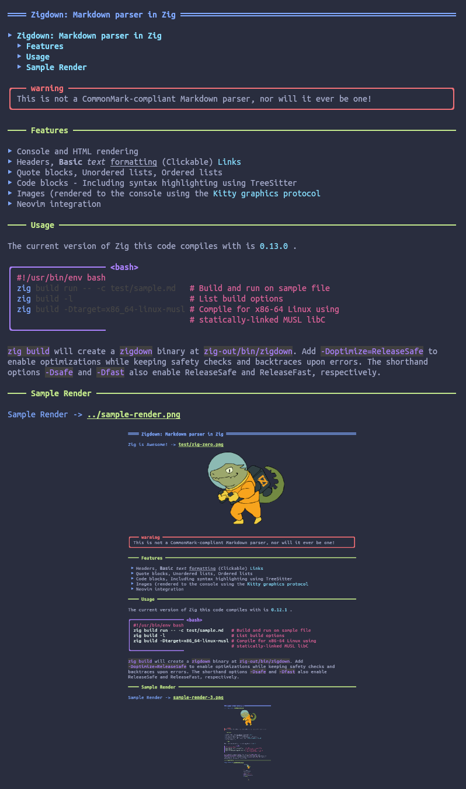
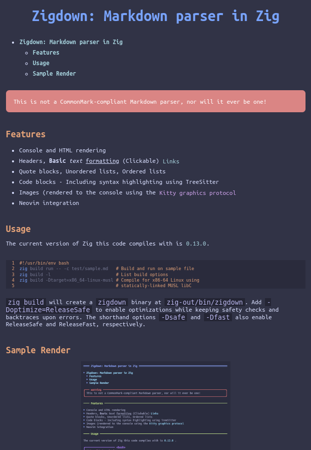

# Zigdown: Markdown parser in Zig

```{toctree}
<This block will be rendered as a Table of Contents>
```


Zigdown, inspired by [Glow](https://github.com/charmbracelet/glow) and
[mdcat](https://github.com/swsnr/mdcat), is a tool to parse and render Markdown-like content to the
terminal or to HTML.

This will likely forever be a WIP, but it currently supports the the most common features of simple
Markdown files.

```{warning}
This is not a CommonMark-compliant Markdown parser, nor will it ever be one!
```

## Features & Future Work

- [x] Console and HTML rendering
- [x] Headers
- [x] Basic text formatting (**Bold**, _italic_, ~underline~)
- [x] (Clickable) Links
- [x] Quote blocks
- [x] Unordered lists
- [x] Ordered lists
- [x] Code blocks, including syntax highlighting using TreeSitter
- [x] Images (rendered to the console using the
  [Kitty graphics protocol](https://sw.kovidgoyal.net/kitty/graphics-protocol/)
- [x] Neovim integration
  - Optional: If you have Lua 5.1 system libraries, can build as a Lua plugin module
- [x] Task lists
- [x] Tables
- [x] Automatic Table of Contents creation
- [x] Autolinks
- [ ] Complete NeoVim integration (w/ image rendering and auto-scrolling)
- [ ] Web-based images (fetch & display in-terminal)
- [ ] References

## Caveats

Note that I am **not** planning to implement complete CommonMark specification support, or even full
Markdown support by any definition. Rather, the goal is to support "nicely formatted" Markdown,
making some simplifying assumptions about what constitutes a paragraph vs. a code block, for
example. The "nicely formatted" caveat simplifies the parser somewhat, enabling easier extension for
new features like special warnings, note boxes, and other custom directives.

## Usage

The current version of Zig this code compiles with is
[0.13.0](https://ziglang.org/builds/zig-linux-x86_64-0.13.0.tar.xz).

```bash
zig build run -- -c test/sample.md
zig build -l # List build options
zig build -Dtarget=x86_64-linux-musl # Compile for x86-64 Linux using
                                     # statically-linked MUSL libC
```

`zig build` will create a `zigdown` binary at `zig-out/bin/zigdown`. Add `-Doptimize=ReleaseSafe` to
enable optimizations while keeping safety checks and backtraces upon errors. The shorthand options
`-Dsafe` and `-Dfast` also enable ReleaseSafe and ReleaseFast, respectively.

## Enabling Syntax Highlighting

To enable syntax highlighting within code blocks, you must install the necessary TreeSitter language
parsers and highlight queries for the languages you'd like to highlight. This can be done by
building and installing each language into a location in your `$LD_LIBRARY_PATH` environment
variable.

### Built-In Parsers

Zigdown comes with a number of TreeSitter parsers and highlight queries built-in:

- bash
- C
- C++
- JSON
- Python
- Rust
- Zig

The parsers are downloaded from Github and the relevant source files are added to the build, and the
queries are stored at `data/queries/`, which contain some fixes and improvements to the original
highlighting queries.

### Installing Parsers Using Zigdown

The Zigdown cli tool can also download and install parsers for you. For example, to download, build,
and install the C and C++ parsers and their highlight queries:

```bash
zigdown -p c,cpp # Assumes both exist at github.com/tree-sitter on the 'master' branch
zigdown -p maxxnino:zig  # Specify the Github user; still assumes the 'master' branch
zigdown -p tree-sitter:master:rust # Specify Github user, branch, and language
```

**TODO:** Load a color scheme and a capture name -> color mapping at runtime (from file) instead of
a short hard-coded mapping.

### Installing Parsers Manually

You can also install manually if Zigdown doesn't properly fetch the repo for you (or if the repo is
not setup in a standard manner and requires custom setup). For example, to install the C++ parser
from the default tree-sitter project on Github:

```bash
#!/usr/bin/env bash

# Ensure the TS_CONFIG_DIR is available
export TS_CONFIG_DIR=$HOME/.config/tree-sitter/
mkdir -p ${TS_CONFIG_DIR}/parsers
cd ${TS_CONFIG_DIR}/parsers

# Clone and build a TreeSitter parser library
git clone https://github.com/tree-sitter/tree-sitter-cpp
cd tree-sitter-cpp
make install PREFIX=$HOME/.local/

# Add the install directory to LD_LIBRARY_PATH (if not done so already)
export LD_LIBRARY_PATH=$LD_LIBRARY_PATH:$HOME/.local/lib/
```

In addition to having the parser libraries available for `dlopen`, you will also need the highlight
queries. For this, use the provided bash script `./tools/fetch_queries.sh`. This will install the
queries to `$TS_CONFIG_DIR/queries`, which defaults to `$HOME/.config/tree-sitter/queries`.

## Sample Renders

### Console



### HTML


